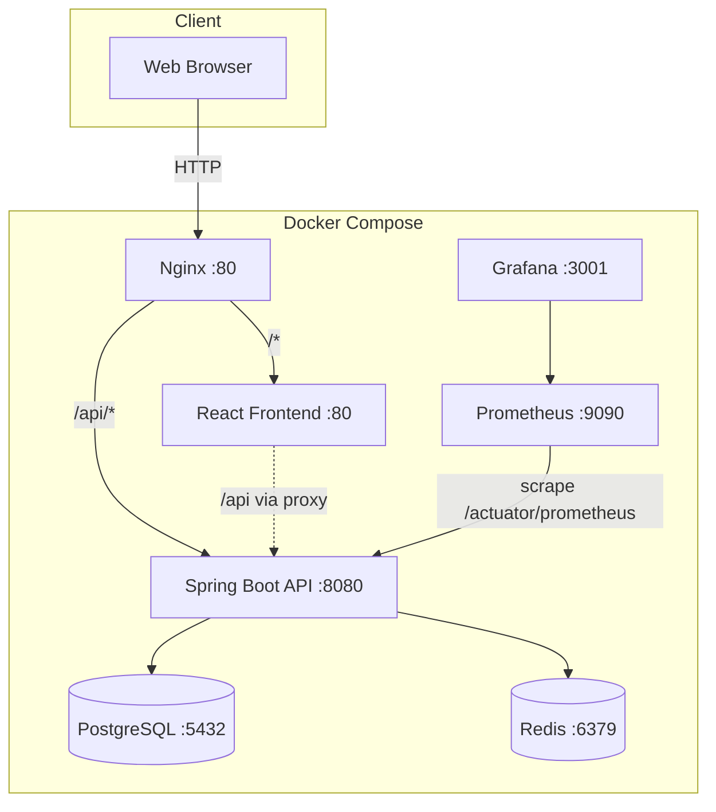

# AI Recruitment Platform

A full-stack recruitment platform that connects **recruiters** and **candidates**. Recruiters post jobs and review applicants; candidates build profiles, apply to roles, and receive an **AI-powered match score** based on keyword overlap between their skills and job requirements.

Built as a portfolio-grade project demonstrating modern Java backend practices, a React SPA, containerized deployment, and observability with Prometheus and Grafana.

---

## Tech Stack


| Layer | Technologies |
|-------|----------------|
| **Backend** | Spring Boot 3, Spring Security, Spring Data JPA, JJWT, Lombok, Actuator |
| **Frontend** | React 18, TypeScript, Vite, Material UI, Redux Toolkit, React Router, Axios |
| **Data** | PostgreSQL 15, Redis 7 |
| **Ops** | Docker Compose, Nginx reverse proxy, Prometheus, Grafana |

---

## Architecture

Traffic enters through **Nginx**, which routes API calls to the Spring Boot backend and all other requests to the React frontend. The backend persists data in **PostgreSQL**, uses **Redis** for caching infrastructure, and exposes **Prometheus** metrics via Spring Actuator. **Grafana** visualizes those metrics.



### Request flow (apply + AI match)

1. **Candidate** updates profile (`skills`, `experience`, `education`).
2. Candidate applies to a job → backend creates an `Application` record.
3. **MatchingService** tokenizes profile + job text, computes overlap %, saves a `MatchScore`.
4. **Recruiter** views applicants for a job with color-coded match badges in the dashboard.

### Project structure

```
ai-recruitment-platform/
├── backend/                 # Spring Boot REST API
├── frontend/                # React + TypeScript SPA
├── nginx/                   # Reverse proxy config
├── monitoring/              # Prometheus scrape config
├── docker-compose.yml       # Full stack orchestration
└── README.md
```

---

## Prerequisites

- **Docker** & **Docker Compose** (recommended), or:
- **Java 21**, **Maven 3.9+**, **Node.js 20+**, **PostgreSQL 15**, **Redis 7**

> Use Java 21 for local Maven builds. Newer JDK versions may require a compatible Lombok release.

---

## How to Run

### Option 1 — Docker Compose (full stack)

From the project root:

```bash
docker compose up --build
```

| Service | URL |
|---------|-----|
| App (via Nginx) | http://localhost |
| Frontend (direct) | http://localhost:3000 |
| Backend API | http://localhost:8080/api |
| Prometheus | http://localhost:9090 |
| Grafana | http://localhost:3001 (login: `admin` / `admin`) |

Stop services:

```bash
docker compose down
```

Reset database volume:

```bash
docker compose down -v
```

### Option 2 — Local development

**1. Start PostgreSQL and Redis** (or use Docker for only those services):

```bash
docker compose up postgres redis -d
```

**2. Backend** (port `8080`):

```bash
cd backend
export JAVA_HOME=$(/usr/libexec/java_home -v 21)   # macOS example
mvn spring-boot:run
```

For a local DB, override in `backend/src/main/resources/application-local.yml` or environment variables:

```bash
export SPRING_DATASOURCE_URL=jdbc:postgresql://localhost:5432/recruitment_db
export SPRING_DATASOURCE_USERNAME=postgres
export SPRING_DATASOURCE_PASSWORD=postgres123
export SPRING_DATA_REDIS_HOST=localhost
```

**3. Frontend** (port `3000`, proxies `/api` → backend):

```bash
cd frontend
npm install
npm run dev
```

Open http://localhost:3000

### Quick test accounts

Register via **http://localhost:3000/register** (or `/register` through Nginx):

| Role | Suggested use |
|------|----------------|
| `RECRUITER` | Post jobs, view applicants & match scores |
| `CANDIDATE` | Edit profile, browse jobs, apply |

---

## API Endpoints

Base URL: `/api` (via Nginx: `http://localhost/api`)

Authenticated routes require header: `Authorization: Bearer <JWT>`

| Method | Endpoint | Auth | Description |
|--------|----------|------|-------------|
| `POST` | `/auth/register` | Public | Register a new user |
| `POST` | `/auth/login` | Public | Login; returns JWT + role |
| `GET` | `/jobs` | JWT | List all job postings |
| `GET` | `/jobs/{id}` | JWT | Get job details |
| `POST` | `/jobs` | JWT (`RECRUITER`) | Create a new job |
| `GET` | `/jobs/{jobId}/applications` | JWT (`RECRUITER`) | List applicants + match scores |
| `POST` | `/applications/apply/{jobId}` | JWT (`CANDIDATE`) | Submit application (triggers AI scoring) |
| `GET` | `/applications/my-applications` | JWT (`CANDIDATE`) | List own applications + scores |
| `GET` | `/profile` | JWT (`CANDIDATE`) | Get candidate profile |
| `PUT` | `/profile` | JWT (`CANDIDATE`) | Update candidate profile |
| `GET` | `/actuator/health` | Public | Health check |
| `GET` | `/actuator/prometheus` | Public | Prometheus metrics |

### Example: login

```bash
curl -X POST http://localhost:8080/api/auth/login \
  -H "Content-Type: application/json" \
  -d '{"email":"recruiter@example.com","password":"secret123"}'
```

### Example: create job (recruiter)

```bash
curl -X POST http://localhost:8080/api/jobs \
  -H "Authorization: Bearer <TOKEN>" \
  -H "Content-Type: application/json" \
  -d '{
    "title": "Senior Java Developer",
    "description": "Build microservices with Spring Boot",
    "requiredSkills": "java,spring,docker,postgresql"
  }'
```

---

## AI Matching Algorithm

Match score is computed as:

```
score = (matched_keywords / job_keywords) × 100
```

- Text from candidate **skills + experience** is compared to job **required skills + description**.
- Keywords are normalized (lowercase, split on spaces/commas, min length 3).
- Results are stored per application and shown as color-coded badges:
  - **Green** ≥ 70% · **Yellow** ≥ 40% · **Red** &lt; 40%

---

## Monitoring

1. Open Grafana at http://localhost:3001
2. Add Prometheus datasource: `http://prometheus:9090`
3. Import dashboard **ID 4701** (JVM Micrometer) for JVM and HTTP metrics

Prometheus scrapes `backend:8080/actuator/prometheus` every 15 seconds (see `monitoring/prometheus.yml`).

---

## Screenshots

Add captures under `docs/screenshots/` and they will render here. Suggested shots:

| # | Screen | File |
|---|--------|------|
| 1 | Login page | `docs/screenshots/login.png` |
| 2 | Register page | `docs/screenshots/register.png` |
| 3 | Job listings | `docs/screenshots/job-list.png` |
| 4 | Candidate dashboard (profile + applications) | `docs/screenshots/candidate-dashboard.png` |
| 5 | Recruiter dashboard (create job + applicants) | `docs/screenshots/recruiter-dashboard.png` |
| 6 | Match score badges | `docs/screenshots/match-score.png` |
| 7 | Grafana metrics | `docs/screenshots/grafana.png` |

### Login


### Job listings


### Candidate dashboard


### Recruiter dashboard


### Match score badges


### Grafana monitoring


> **Note:** Placeholder paths above. Replace with your own screenshots after running the app, or remove broken image links until assets are added.

---

## License

This project is provided for educational and portfolio purposes. Add your preferred license file if you plan to open-source it.

---

## Acknowledgments

Architecture and implementation follow the **AI Recruitment Platform** guide (`ai-recruitment-platform-guide.md`) — a full-stack reference for junior developers learning Spring Boot, React, Docker, and observability.
